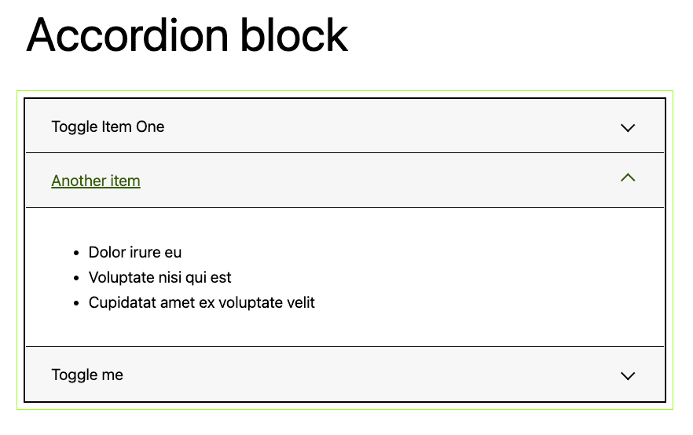

# Accordion block

A simple, accessible accordion block for WordPress that supports all WordPress blocks All WordPress blocks are available to use in the accordion body and rich the accordion title supports rich text formatting.

Most of the markup follows the [W3C ARIA Authoring Practices](https://www.w3.org/WAI/ARIA/apg/example-index/accordion/accordion.html).

Demonstration of Accordion block with the upcoming Twenty Twenty-Three theme.

## Changelog

### 0.1.2

* Fix: Block toolbar
* Add: Title tag option

### 0.1.1

* Update

### 0.1.0

* Initial release
